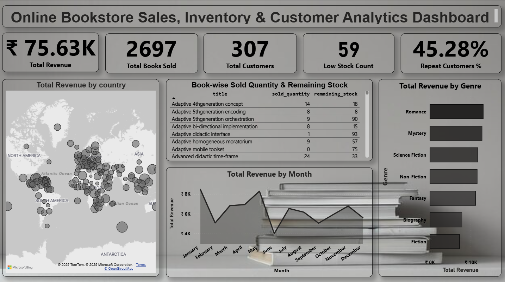

# 📚 Online Bookstore Dashboard

This Power BI project analyzes sales performance, inventory status, and customer spending behavior for an online bookstore. The dataset is extracted using SQL queries and visualized through interactive dashboards.

---

## 📊 Dashboard Preview

---

## 🔧 Tools & Technologies Used

- **Power BI** – Data modeling, DAX, and visualization
- **SQL** – Data extraction and transformation
- **DAX** – Calculated measures and KPIs

---

## 📁 Files in This Repository

| File | Description |
|------|-------------|
| `OnlineBookStore_Dashboard.pbix` | Power BI Dashboard file |
| `SQL_Queries.sql` | SQL queries used to extract and prepare the dataset |
| `dashboard_preview.png` | Screenshot of the dashboard |
| `README.md` | Project summary and documentation |

---

## 🔍 Key Insights

- Tracked book sales by genre, author, and title
- Visualized sold quantity vs. remaining stock
- Analyzed customer-wise spending and repeat purchases

---

## 🚀 How to Use

1. Clone or download this repository
2. Open `.pbix` in Power BI Desktop
3. Review SQL queries in the `.sql` file
4. Modify or connect to your own database as needed

---
💡 Created by:
Swati Hegde
